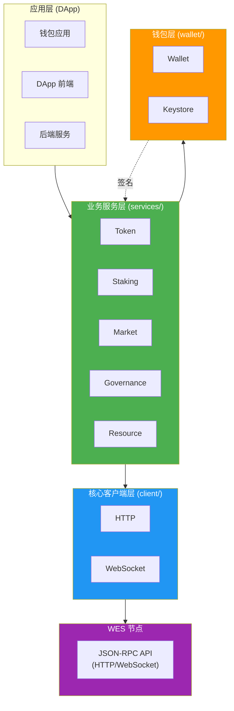
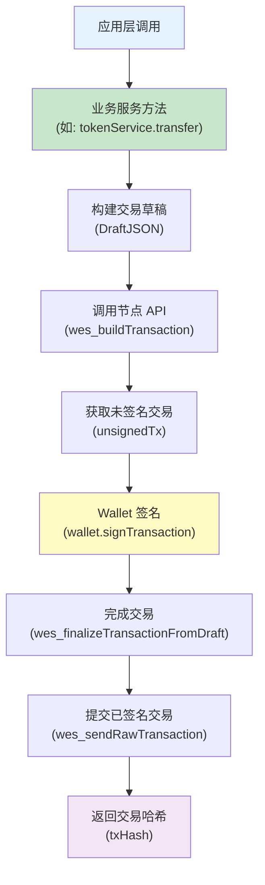

# WES Client SDK for JavaScript/TypeScript

<div align="center">

<pre>
__          ________ _____  _______     ___   _ 
\ \        / /  ____|_   _|/ ____\ \   / / \ | |
 \ \  /\  / /| |__    | | | (___  \ \_/ /|  \| |
  \ \/  \/ / |  __|   | |  \___ \  \   / | . ` |
   \  /\  /  | |____ _| |_ ____) |  | |  | |\  |
    \/  \/   |______|_____|_____/   |_|  |_| \_|
</pre>

**WES 区块链客户端开发工具包 - JavaScript/TypeScript 版本**  
**为前端应用、浏览器 DApp 和 Node.js 服务提供完整的 WES 区块链交互能力**

[](https://www.npmjs.com/package/@weisyn/client-sdk-js)
[](LICENSE)
[](https://www.typescriptlang.org/)

[🚀 快速开始](#-快速开始) • [📚 文档中心](./docs/README.md) • [💡 核心特性](#-核心特性) • [🏗️ 架构概览](#️-架构概览)

</div>

---

## 📦 简介

WES Client SDK 是一个用于开发 WES 区块链应用的 JavaScript/TypeScript 客户端工具包。它提供了与 WES 节点交互的完整接口，支持交易构建、签名、提交以及业务语义封装。

> 💡 **文档导航**：完整的 SDK 文档请查看 [📚 文档中心](./docs/README.md)

> 💡 **Client SDK vs Contract SDK**：
> - **Client SDK**（本仓库）：用于链外应用开发（DApp、钱包、浏览器、后端服务），通过 API 与节点交互
> - **Contract SDK**：用于链上智能合约开发（WASM 合约），运行在 WES 节点上
> 
> 详见：[Contract SDK (Go)](https://github.com/weisyn/contract-sdk-go)

### 核心业务服务

SDK 提供5个完整的业务服务模块：

| 服务 | 功能 | 状态 | 详细文档 |
|------|------|------|---------|
| **Token** | 转账、批量转账、铸造、销毁、余额查询 | ✅ 完整 | [Token 服务文档](docs/guides/token.md) |
| **Staking** | 质押、解质押、委托、取消委托、领取奖励 | ✅ 完整 | [Staking 服务文档](docs/guides/staking.md) |
| **Market** | AMM 交换、流动性管理、归属计划、托管 | ✅ 完整 | [Market 服务文档](docs/guides/market.md) |
| **Governance** | 提案、投票、参数更新 | ✅ 完整 | [Governance 服务文档](docs/guides/governance.md) |
| **Resource** | 合约部署、AI 模型部署、静态资源部署、资源查询 | ✅ 完整 | [Resource 服务文档](docs/guides/resource.md) |

### 核心特性

- ✅ **完整 API 封装** - 封装 HTTP/WebSocket 调用
- ✅ **业务语义服务** - 提供 Token、Staking、Market、Governance、Resource 等业务服务
- ✅ **交易构建与签名** - 完整的离线/在线交易构建与签名流程
- ✅ **事件订阅** - 支持实时事件订阅（WebSocket）
- ✅ **密钥管理** - 安全的密钥管理和钱包功能
- ✅ **多协议支持** - HTTP、WebSocket 两种传输协议
- ✅ **TypeScript 支持** - 完整的 TypeScript 类型定义
- ✅ **浏览器和 Node.js** - 同时支持浏览器和 Node.js 环境
- ✅ **完全独立** - 不依赖任何 WES 内部包，可独立发布

### 架构理念

**WES 协议层提供基础能力，SDK 层实现业务语义**：

- **WES 协议层**：提供固化的基础能力
  - 2种输入模式（AssetInput、ResourceInput）
  - 3种输出类型（AssetOutput、StateOutput、ResourceOutput）
  - 7种锁定条件（SingleKey、MultiKey、Contract、Delegation、Threshold、Time、Height）
  
- **SDK 层**：将基础能力组合成业务语义
  - 转账、质押、投票等业务操作 = 输入输出和锁定条件的组合
  - 所有业务语义都在 SDK 层实现，不依赖节点业务服务 API

> 📖 **详细说明**：详见 [设计原则 - 业务语义在 SDK 层](#-设计原则) | [架构文档](docs/architecture.md)

## 🏗️ 架构概览

> 📖 **完整架构文档**：详见 [架构设计文档](docs/architecture.md)

### SDK 内部分层架构

在 SDK 仓库内部，采用清晰的分层设计：



### 交易流程



## 🚀 快速开始

> 📖 **完整快速开始指南**：详见 [快速开始文档](docs/getting-started.md)

### 安装

```bash
npm install @weisyn/client-sdk-js
# 或
yarn add @weisyn/client-sdk-js
# 或
pnpm add @weisyn/client-sdk-js
```

### 第一个应用

```typescript
import { Client, TokenService, Wallet } from '@weisyn/client-sdk-js';

// 1. 初始化客户端
const client = new Client({
  endpoint: 'http://localhost:8545',
  protocol: 'http',
});

// 2. 创建钱包
const wallet = Wallet.fromPrivateKey('0x...');

// 3. 创建 Token 服务
const tokenService = new TokenService(client, wallet);

// 4. 执行转账
const result = await tokenService.transfer({
  from: wallet.address,
  to: '0x...',
  amount: 1000000, // 1 WES (假设 6 位小数)
  tokenId: null, // null 表示原生币
});

console.log(`转账成功！交易哈希: ${result.txHash}`);
```

### 浏览器中使用

```html
<!DOCTYPE html>
<html>
<head>
  <script src="https://unpkg.com/@weisyn/client-sdk-js/dist/index.umd.js"></script>
</head>
<body>
  <script>
    const { Client, TokenService, Wallet } = WESClientSDK;
    
    const client = new Client({
      endpoint: 'http://localhost:8545',
      protocol: 'http',
    });
    
    // ... 使用 SDK
  </script>
</body>
</html>
```

## 📚 核心概念

### 1. 客户端初始化

SDK 支持两种传输协议：

```typescript
// HTTP 客户端（最常用）
const client = new Client({
  endpoint: 'http://localhost:8545',
  protocol: 'http',
  timeout: 30000,
});

// WebSocket 客户端（用于事件订阅）
const wsClient = new Client({
  endpoint: 'ws://localhost:8081',
  protocol: 'websocket',
});
```

### 2. 业务服务

所有业务服务都遵循相同的设计模式：

```typescript
// 创建服务实例
const tokenService = new TokenService(client, wallet);

// 调用业务方法
const result = await tokenService.transfer({...});
```

#### Token 服务

```typescript
const tokenService = new TokenService(client, wallet);

// 单笔转账
const result = await tokenService.transfer({
  from: fromAddr,
  to: toAddr,
  amount: 1000,
  tokenId: null, // null = 原生币
});

// 批量转账
const result = await tokenService.batchTransfer({
  from: fromAddr,
  transfers: [
    { to: addr1, amount: 100, tokenId: tokenID },
    { to: addr2, amount: 200, tokenId: tokenID },
  ],
});

// 代币铸造
const result = await tokenService.mint({
  to: recipientAddr,
  amount: 10000,
  tokenId: tokenID,
  contractAddr: contractAddr,
});

// 查询余额
const balance = await tokenService.getBalance(address, tokenID);
```

### 3. 钱包功能

```typescript
// 创建新钱包
const wallet = Wallet.create();

// 从私钥创建钱包
const wallet = Wallet.fromPrivateKey('0x...');

// 获取地址
const address = wallet.address; // Uint8Array (20 字节)

// 签名交易
const signedTx = await wallet.signTransaction(unsignedTxBytes);

// 签名消息
const signature = await wallet.signMessage(messageBytes);
```

### 4. 事件订阅

```typescript
// 使用 WebSocket 客户端订阅事件
const wsClient = new Client({
  endpoint: 'ws://localhost:8081',
  protocol: 'websocket',
});

const subscription = await wsClient.subscribe({
  topics: ['Transfer', 'Mint'],
  from: fromAddr,
  to: toAddr,
});

subscription.on('event', (event) => {
  console.log(`收到事件: ${event.topic}, 数据: ${event.data}`);
});
```

## 🏗️ 目录结构

```
client-sdk-js/
│
├── src/                    # 源代码
│   ├── client/            # 核心客户端层
│   │   ├── client.ts      # Client 接口定义
│   │   ├── config.ts      # 配置管理
│   │   ├── errors.ts      # 错误定义
│   │   ├── http.ts        # HTTP 客户端实现
│   │   └── websocket.ts   # WebSocket 客户端实现
│   │
│   ├── services/          # 业务服务层
│   │   ├── token/         # Token 服务
│   │   ├── staking/       # Staking 服务
│   │   ├── market/        # Market 服务
│   │   ├── governance/    # Governance 服务
│   │   └── resource/      # Resource 服务
│   │
│   ├── wallet/           # 钱包功能
│   │   ├── wallet.ts      # Wallet 接口和实现
│   │   └── keystore.ts    # Keystore 管理器
│   │
│   ├── utils/            # 工具函数
│   │   └── address.ts     # 地址转换工具
│   │
│   └── index.ts          # 入口文件
│
├── examples/             # 示例代码
│   └── simple-transfer/
│       └── index.ts
│
├── tests/                # 测试代码
│
├── dist/                 # 构建输出
│
├── package.json
├── tsconfig.json
└── README.md
```

## 📖 文档

### 快速开始
- **[快速开始指南](./docs/getting-started.md)** - 安装、配置、第一个示例
- **[概述](./docs/overview.md)** - SDK 视角的 WES 核心概念

### 完整文档
- **[📚 文档中心](./docs/README.md)** - 完整的文档导航
- **[API 参考](./docs/api/)** - 完整的 API 文档
- **[使用指南](./docs/guides/)** - 业务场景使用指南
- **[参考文档](./docs/reference/)** - 工具和最佳实践

### 其他
- **[测试指南](./docs/testing.md)** - 单元测试和集成测试
- **[故障排查](./docs/troubleshooting.md)** - 常见问题和解决方案

## 🔒 安全考虑

### 1. 密钥管理

- ✅ 私钥不离开钱包
- ✅ 支持 Keystore 加密存储
- ✅ 浏览器环境使用 Web Crypto API
- ✅ Node.js 环境使用 crypto 模块

### 2. 交易签名流程

1. 构建未签名交易 (SDK 层) - 不包含私钥信息
2. Wallet 签名 (客户端) - 私钥不离开钱包
3. 提交已签名交易 (API) - 节点验证签名
4. 广播到网络 - 交易上链

### 3. 连接安全

- ✅ TLS 支持（HTTPS/WSS）
- ✅ 超时控制
- ✅ 重试机制

## 🎯 设计原则

### 1. SDK 独立性

- ✅ 只依赖标准库和通用第三方库
- ✅ 通过 API（JSON-RPC/HTTP/WebSocket）与节点交互
- ✅ 不依赖任何 WES 内部包

### 2. 业务语义在 SDK 层

SDK 层提供业务语义接口，底层调用通用 API。

## 🐛 调试技巧

### 1. 启用调试模式

```typescript
const client = new Client({
  endpoint: 'http://localhost:8545',
  protocol: 'http',
  debug: true, // 启用调试日志
});
```

## 📦 版本兼容性

| SDK 版本 | API 版本 | Node.js 版本 | 状态 |
|---------|----------|-------------|------|
| v0.1.0-alpha | v1.0.0 | 18+ | ✅ 开发中 |

## 🤝 贡献

欢迎提交 Issue 和 Pull Request！

## 📄 许可证

Apache-2.0 License

## 🔗 相关资源

### WES 生态

- [WES 主项目](https://github.com/weisyn/weisyn-core) - WES 区块链核心实现
- [Contract SDK (Go)](https://github.com/weisyn/contract-sdk-go) - 智能合约开发 SDK（Go/Rust/AS/C）
- [Client SDK (Go)](https://github.com/weisyn/client-sdk-go) - 客户端 SDK（Go 版本）
- [Client SDK (JS/TS)](https://github.com/weisyn/client-sdk-js) - 客户端 SDK（JavaScript/TypeScript 版本）⭐ 当前仓库

### SDK 对比

| 特性 | Go SDK | JS/TS SDK | 说明 |
|------|--------|-----------|------|
| **语言** | Go | JavaScript/TypeScript | - |
| **环境** | 服务器/CLI | 浏览器/Node.js | - |
| **Token 服务** | ✅ 完整 | ✅ 完整 | 转账、批量转账、铸造、销毁、余额查询 |
| **Staking 服务** | ✅ 完整 | ✅ 完整 | 质押、解质押、委托、取消委托、领取奖励 |
| **Market 服务** | ✅ 完整 | ✅ 完整 | AMM 交换、流动性管理、归属计划、托管 |
| **Governance 服务** | ✅ 完整 | ✅ 完整 | 提案、投票、参数更新 |
| **Resource 服务** | ✅ 完整 | ✅ 完整 | 合约部署、AI 模型部署、静态资源部署、资源查询 |
| **Wallet** | ✅ 完整 | ✅ 完整 | 密钥生成、签名、地址派生 |
| **传输协议** | HTTP/gRPC/WebSocket | HTTP/WebSocket | Go SDK 额外支持 gRPC |
| **仓库** | [client-sdk-go](https://github.com/weisyn/client-sdk-go) | [client-sdk-js](https://github.com/weisyn/client-sdk-js) | - |

> 📖 **详细能力对比**：两个 SDK 的能力对比请查看 [Go/JS SDK 能力对比文档](../client-sdk-go.git/docs/capability-comparison.md)

> 💡 **提示**：两个 SDK 提供相同的业务语义接口，可以根据项目需求选择合适的语言版本。

---

**最后更新**: 2025-01-23

