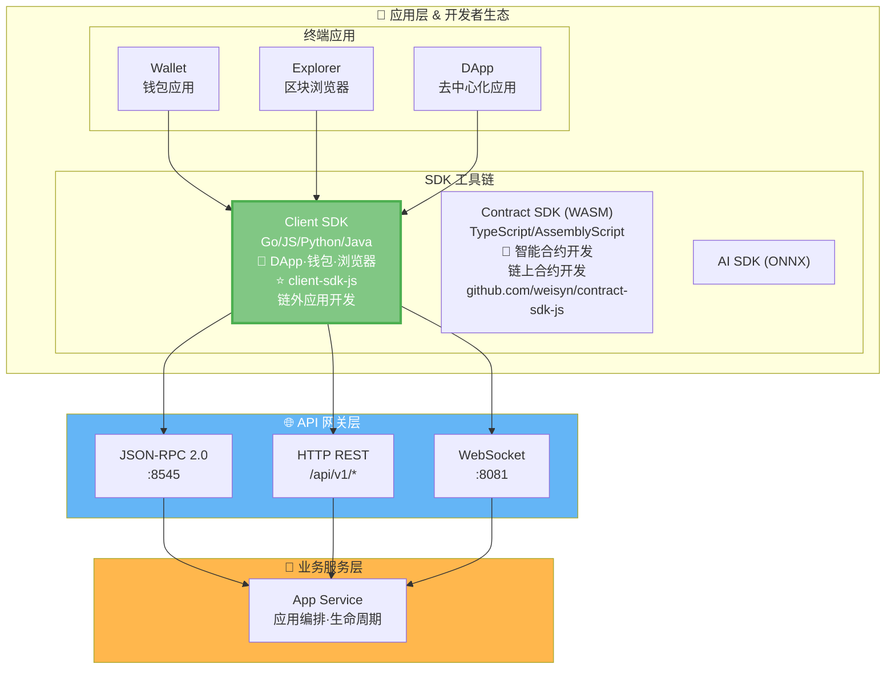
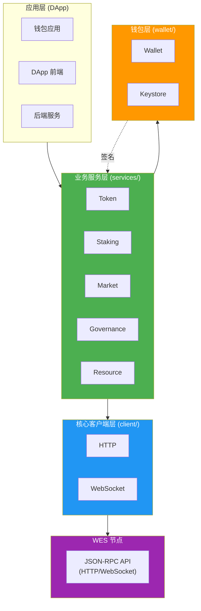

# WES Client SDK for JavaScript/TypeScript

<div align="center">

<pre>
__          ________ _____  _______     ___   _ 
\ \        / /  ____|_   _|/ ____\ \   / / \ | |
 \ \  /\  / /| |__    | | | (___  \ \_/ /|  \| |
  \ \/  \/ / |  __|   | |  \___ \  \   / | . ` |
   \  /\  /  | |____ _| |_ ____) |  | |  | |\  |
    \/  \/   |______|_____|_____/   |_|  |_| \_|
</pre>

**WES 区块链客户端开发工具包 - JavaScript/TypeScript 版本**  
**为前端应用、浏览器 DApp 和 Node.js 服务提供完整的 WES 区块链交互能力**

[](https://www.npmjs.com/package/@weisyn/client-sdk-js)
[](LICENSE)
[](https://www.typescriptlang.org/)

[🚀 快速开始](#-快速开始) • [🎯 使用场景](#-使用场景) • [💡 核心能力](#-核心能力) • [🏗️ 架构概览](#️-架构概览) • [📚 文档导航](#-文档导航)

</div>

---

## 🌟 它能帮你做什么？

在传统区块链开发中，开发者需要：
- ❌ 理解底层协议细节（UTXO、交易构建、签名等）
- ❌ 手动构建交易（选择输入、创建输出、计算手续费）
- ❌ 处理复杂的业务逻辑组合（转账、授权、质押等）

**WES Client SDK 让这一切成为过去**：

- ✅ **业务语义优先** - 提供 `Transfer()`、`Stake()`、`Vote()` 等直观的业务接口
- ✅ **TypeScript 支持** - 完整的 TypeScript 类型定义和编译期检查
- ✅ **浏览器 & Node.js** - 同时支持浏览器和 Node.js 环境
- ✅ **企业级能力** - 支持完整的业务服务（Token、Staking、Market、Governance、Resource）
- ✅ **类型安全** - 完整的类型定义和编译期检查，减少运行时错误

> 💡 **文档导航**：完整的 SDK 文档请查看 [📚 文档中心](./docs/README.md)

> 💡 **Client SDK vs Contract SDK**：
> - **Client SDK**（本仓库）：用于链外应用开发（DApp、钱包、浏览器、后端服务），通过 API 与节点交互
> - **Contract SDK**：用于链上智能合约开发（WASM 合约），运行在 WES 节点上
> 
> 详见：[Contract SDK (Go)](https://github.com/weisyn/contract-sdk-go)

---

## 🚀 快速开始

### 前置要求

- **Node.js 20+** - 用于开发环境
- **TypeScript 5.0+** - 用于类型检查（可选但推荐）

### 安装 SDK

```bash
npm install @weisyn/client-sdk-js
# 或
yarn add @weisyn/client-sdk-js
# 或
pnpm add @weisyn/client-sdk-js
```

### 第一个应用

```typescript
import { Client, TokenService, Wallet } from '@weisyn/client-sdk-js';

// 1. 初始化客户端
const client = new Client({
  endpoint: 'http://localhost:8545',
  protocol: 'http',
});

// 2. 创建钱包
const wallet = Wallet.fromPrivateKey('0x...');

// 3. 创建 Token 服务
const tokenService = new TokenService(client, wallet);

// 4. 执行转账
const result = await tokenService.transfer({
  from: wallet.address,
  to: '0x...',
  amount: 1000000, // 1 WES (假设 6 位小数)
  tokenId: null, // null 表示原生币
});

console.log(`转账成功！交易哈希: ${result.txHash}`);
```

### 浏览器中使用

```html
<!DOCTYPE html>
<html>
<head>
  <script src="https://unpkg.com/@weisyn/client-sdk-js/dist/index.umd.js"></script>
</head>
<body>
  <script>
    const { Client, TokenService, Wallet } = WESClientSDK;
    
    const client = new Client({
      endpoint: 'http://localhost:8545',
      protocol: 'http',
    });
    
    // ... 使用 SDK
  </script>
</body>
</html>
```

> 📖 **完整指南**：[开发者指南](./docs/DEVELOPER_GUIDE.md) | [快速开始文档](./docs/getting-started.md)

---

## 🎯 使用场景

### 按角色选择使用方式

| 角色 | 推荐使用方式 | 说明 |
|------|------------|------|
| **合约开发者** | `WESClient` + `ResourceService` | 部署合约、查询合约状态、调用合约方法 |
| **Workbench 用户** | `WESClient` + 业务服务（`TokenService`、`StakingService` 等） | 完整的业务操作，包括合约部署、代币操作、质押等 |
| **后端服务** | `WESClient` + 业务服务 | 服务器端应用，需要完整的业务语义支持 |
| **DApp 前端** | `WESClient` + `Wallet` | 浏览器应用，需要钱包集成和用户交互（推荐使用 ESM 包和 Tree Shaking） |
| **工具链开发者** | 底层 `Client` 接口 | 需要直接调用 JSON-RPC 或自定义逻辑 |

> 📖 **详细指南**：
> - [WESClient 使用示例](./docs/examples/wesclient.md) - 类型化 API 使用
> - [业务服务指南](./docs/guides/) - 完整的业务服务说明
> - [业务场景实现指南](./docs/BUSINESS_SCENARIOS.md) - 如何实现业务场景

---

## 💡 核心能力

### 1. 🎯 WESClient 类型化 API

SDK 提供强类型的 `WESClient` 接口，封装所有核心 RPC 调用：

```typescript
import { WESClient } from '@weisyn/client-sdk-js';

// 初始化 WESClient
const wesClient = new WESClient({
  endpoint: 'http://localhost:8545',
  protocol: 'http',
});

// UTXO 操作
// 通过地址查询所有 UTXO（地址模型，与节点 API 对齐）
const utxos = await wesClient.listUTXOs(address);

// 资源操作
const resource = await wesClient.getResource(contentHash);

// 交易操作
const tx = await wesClient.getTransaction(txHash);
const txHash = await wesClient.submitTransaction(signedTx);
```

> 📖 **详细文档**：[API 参考](./docs/API_REFERENCE.md#wesclient-类型化-api)

### 2. 🔧 业务服务层

SDK 提供完整的业务服务模块，让开发者专注于业务逻辑：

| 服务 | 功能 | 详细文档 |
|------|------|---------|
| **Token** | 转账、批量转账、铸造、销毁、余额查询 | [Token 服务](./docs/API_REFERENCE.md#token-服务) |
| **Staking** | 质押、解质押、委托、取消委托、领取奖励 | [Staking 服务](./docs/API_REFERENCE.md#staking-服务) |
| **Market** | AMM 交换、流动性管理、归属计划、托管 | [Market 服务](./docs/API_REFERENCE.md#market-服务) |
| **Governance** | 提案、投票、参数更新 | [Governance 服务](./docs/API_REFERENCE.md#governance-服务) |
| **Resource** | 合约部署、AI 模型部署、静态资源部署、资源查询 | [Resource 服务](./docs/API_REFERENCE.md#resource-服务) |

> 📖 **完整能力矩阵**：详见 [API 参考](./docs/API_REFERENCE.md)

### 3. 🔐 交易构建与签名

完整的离线/在线交易构建与签名流程：

```typescript
// 业务服务自动处理交易构建
const result = await tokenService.transfer(req);

// SDK 内部流程：
// 1. 构建交易草稿 (DraftJSON)
// 2. 调用节点 API (wes_buildTransaction)
// 3. Wallet 签名
// 4. 完成交易 (wes_finalizeTransactionFromDraft)
// 5. 提交交易 (wes_sendRawTransaction)
```

> 📖 **详细流程**：详见 [开发者指南](./docs/DEVELOPER_GUIDE.md#交易流程)

### 4. 📡 事件订阅 & 钱包

- **事件订阅**：支持实时事件订阅（WebSocket）
- **密钥管理**：安全的密钥管理和钱包功能
- **浏览器支持**：使用 Web Crypto API，Node.js 使用 crypto 模块

> 📖 **详细文档**：详见 [API 参考](./docs/API_REFERENCE.md#事件订阅) | [钱包功能](./docs/API_REFERENCE.md#钱包功能)

### 5. 🌐 浏览器 & Node.js 支持

- **浏览器**：支持 ESM、UMD 格式，支持 Tree Shaking
- **Node.js**：支持 CJS、ESM 格式
- **TypeScript**：完整的类型定义

> 📖 **环境限制和兼容性**：详见 [语言与环境限制](./docs/LANGUAGE_AND_ENV_LIMITATIONS.md)

---

## 🏗️ 架构概览

> 📖 **完整架构文档**：详见 [SDK 架构文档](./docs/SDK_ARCHITECTURE.md) | [架构规划文档](./docs/ARCHITECTURE_PLAN.md)

### 在 WES 7 层架构中的位置

`client-sdk-js` 位于 WES 系统的**应用层 & 开发者生态**中的 **SDK 工具链**，通过 **API 网关层**与 WES 节点交互：



> 📖 **完整 WES 架构**：详见 [WES 系统架构文档](https://github.com/weisyn/go-weisyn/blob/main/docs/system/architecture/1-STRUCTURE_VIEW.md#-系统分层架构)  
> 📜 **Contract SDK**：用于链上智能合约开发，详见 [Contract SDK (JS)](https://github.com/weisyn/contract-sdk-js)

### SDK 内部分层架构

SDK 采用分层架构，**应用开发者只需使用业务服务层**：



**关键原则**：
- ✅ **应用开发者**：只使用 `services` 层的业务语义接口
- ✅ **SDK 职责**：自动处理底层协议细节（交易构建、签名、提交等）
- ❌ **不需要了解**：底层协议实现细节

> 📖 **完整架构和交易流程**：详见 [SDK 架构文档](./docs/SDK_ARCHITECTURE.md)

---

## 📖 文档导航

### 🎯 按角色导航

**👨‍💻 应用开发者**

- [快速开始](#-快速开始) → [开发者指南](./docs/DEVELOPER_GUIDE.md) → [业务场景实现指南](./docs/BUSINESS_SCENARIOS.md)

**🏗️ 架构师/贡献者**

- [架构概览](#-架构概览) → [文档中心](./docs/README.md) → [架构设计文档](./docs/SDK_ARCHITECTURE.md)

**📚 深入理解**

- [API 参考](./docs/API_REFERENCE.md) → [业务场景实现指南](./docs/BUSINESS_SCENARIOS.md)

### 📘 核心文档

| 文档 | 说明 | 受众 |
|------|------|------|
| ⭐ **[主 README](./README.md)** | SDK 总览和快速开始 | 所有用户 |
| 📖 **[文档中心](./docs/README.md)** | 完整文档索引和导航 | 所有用户 |
| 🚀 **[开发者指南](./docs/DEVELOPER_GUIDE.md)** | 如何使用 TS/JS SDK 开发应用 | 应用开发者 |
| 📚 **[API 参考](./docs/API_REFERENCE.md)** | TS/JS SDK 接口详细说明 | 应用开发者 |
| 🎯 **[业务场景实现指南](./docs/BUSINESS_SCENARIOS.md)** | 如何实现业务场景 | 应用开发者 |
| 🏗️ **[架构设计文档](./docs/SDK_ARCHITECTURE.md)** | SDK 架构设计讨论 | 架构师/贡献者 |
| ⚠️ **[语言与环境限制](./docs/LANGUAGE_AND_ENV_LIMITATIONS.md)** | TypeScript/JavaScript 限制和最佳实践 | 应用开发者 |

### 🔗 模块文档

- **[WESClient 使用示例](./docs/examples/wesclient.md)** - 类型化 API 使用
- **[业务服务指南](./docs/guides/)** - 完整的业务服务说明
- **[钱包功能](./docs/api/wallet.md)** - 钱包功能详细说明

> 📖 **完整文档导航**：[文档中心](./docs/README.md)

---

## 🆚 与其他 SDK 的对比

| 特性 | 传统 SDK | WES SDK |
|------|---------|---------|
| **API 设计** | 底层原语（TxAddInput 等） | 业务语义（Transfer、Stake 等） |
| **业务语义** | 需要手动组合 | SDK 层自动处理 |
| **复杂业务** | 难以实现长事务 | 支持原子性长事务 |
| **类型安全** | 部分支持 | 完整类型系统（TypeScript） |
| **学习曲线** | 需要了解底层协议 | 直观的业务接口 |

### Go SDK vs JS SDK

| 维度 | Go SDK | JS SDK |
|------|--------|--------|
| **语言** | Go | JavaScript/TypeScript |
| **环境** | 服务器/CLI | 浏览器/Node.js |
| **业务语义** | ✅ 一致 | ✅ 一致 |
| **传输协议** | HTTP/gRPC/WebSocket | HTTP/WebSocket |
| **类型系统** | Go 类型系统 | TypeScript 类型系统 |

> 📖 **能力对比**：详见 [应用场景分析](./docs/APPLICATION_SCENARIOS_ANALYSIS.md)

---

## 🤝 贡献指南

我们欢迎社区贡献！查看 [贡献指南](../CONTRIBUTING.md) 了解详情。

```bash
# 设置开发环境
npm install
npm run build

# 运行测试
npm test

# 提交变更
git commit -S -m "feat: your contribution"
git push origin your-branch
```

---

## 📄 许可证

本项目基于 Apache-2.0 许可证开源 - 详见 [LICENSE](../LICENSE) 文件。

---

## 🔗 相关链接

### WES 平台资源

- [WES 主项目](https://github.com/weisyn/weisyn) - WES 区块链主仓库
- [WES 文档中心](../../../weisyn.git/docs/) - 完整技术文档
- [WES 系统架构](../../../weisyn.git/docs/system/architecture/) - 系统架构详解
- [WES 主 README](../../../weisyn.git/README.md) - WES 项目总览

### SDK 相关资源

- [Contract SDK Go](../../contract-sdk-go.git/README.md) - Go 合约 SDK
- [Contract SDK JS](../../contract-sdk-js.git/README.md) - TypeScript 合约 SDK
- [Client SDK Go](../../client-sdk-go.git/README.md) - Go 客户端 SDK
- [Model Workbench](../../workbench/model-workbench.git/README.md) - 模型工作台

---

<div align="center">

### 让区块链应用开发回归业务本质

[立即开始](#-快速开始) • [查看文档](./docs/README.md) • [API 参考](./docs/API_REFERENCE.md)

Made with ❤️ by the WES Team

</div>

---
