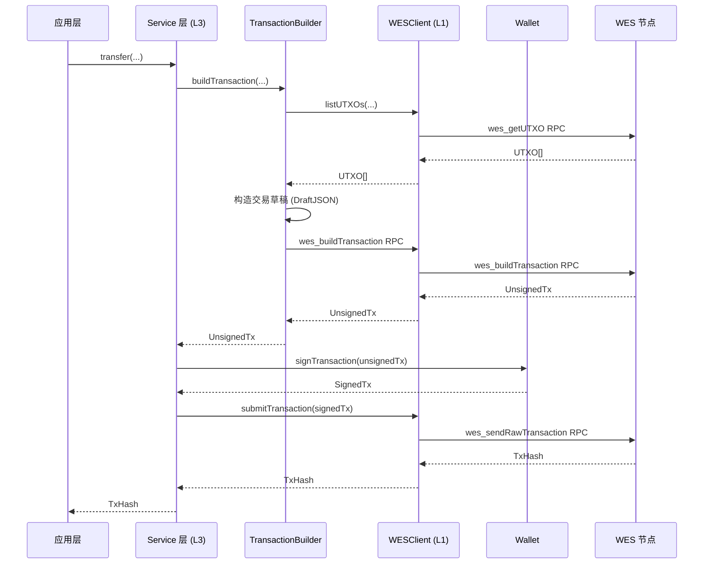

# WES 客户端应用开发指南 - JS/TS SDK 视角

**版本**: v1.0.0  


---

## 📋 文档定位

> 📌 **重要说明**：本文档聚焦 **JS/TS SDK 视角**的客户端应用开发指南。  
> 如需了解 WES 平台的核心概念、架构设计、交易模型等，请参考主仓库文档。

**本文档目标**：
- 说明如何使用 JS/TS SDK 开发 WES 客户端应用
- 讲解常见开发模式（客户端初始化、业务服务使用、交易构建、事件订阅等）
- 提供从安装到部署的完整开发流程
- **引用平台文档**：平台概念（UTXO、交易模型等）请参考主仓库文档

**前置阅读**（平台级文档，来自主仓库）：
- [WES 系统架构文档](../../../weisyn.git/docs/system/architecture/1-STRUCTURE_VIEW.md) - 系统架构总览
- [JSON-RPC API 规范](../../../weisyn.git/docs/reference/json-rpc/) - API 规范说明
- [交易模型文档](../../../weisyn.git/docs/tutorials/transactions/) - UTXO 交易模型详解

---

## 🚀 快速开始

### 前置要求

- **Node.js 20+** - 用于开发环境
- **TypeScript 5.0+** - 用于类型检查（可选但推荐）

### 安装 SDK

```bash
npm install @weisyn/client-sdk-js
# 或
yarn add @weisyn/client-sdk-js
# 或
pnpm add @weisyn/client-sdk-js
```

### 第一个应用

```typescript
import { Client, TokenService, Wallet } from '@weisyn/client-sdk-js';

// 1. 初始化客户端
const client = new Client({
  endpoint: 'http://localhost:28680',
  protocol: 'http',
});

// 2. 创建钱包
const wallet = Wallet.fromPrivateKey('0x...');

// 3. 创建 Token 服务
const tokenService = new TokenService(client, wallet);

// 4. 执行转账
const result = await tokenService.transfer({
  from: wallet.address,
  to: '0x...',
  amount: 1000000, // 1 WES (假设 6 位小数)
  tokenId: null, // null 表示原生币
});

console.log(`转账成功！交易哈希: ${result.txHash}`);
```

### 浏览器中使用

```html
<!DOCTYPE html>
<html>
<head>
  <script src="https://unpkg.com/@weisyn/client-sdk-js/dist/index.umd.js"></script>
</head>
<body>
  <script>
    const { Client, TokenService, Wallet } = WESClientSDK;
    
    const client = new Client({
      endpoint: 'http://localhost:28680',
      protocol: 'http',
    });
    
    // ... 使用 SDK
  </script>
</body>
</html>
```

---

## 📚 核心概念

### 1. 客户端初始化

SDK 支持两种传输协议（浏览器环境不支持 gRPC）：

```typescript
// HTTP 客户端（最常用）
const client = new Client({
  endpoint: 'http://localhost:28680',
  protocol: 'http',
  timeout: 30000,
});

// WebSocket 客户端（用于事件订阅）
const wsClient = new Client({
  endpoint: 'ws://localhost:28681',
  protocol: 'websocket',
});
```

### 2. WESClient 类型化 API

`WESClient` 提供类型化的 RPC 封装，推荐使用：

```typescript
import { WESClient } from '@weisyn/client-sdk-js';

// 创建 WESClient
const wesClient = new WESClient({
  endpoint: 'http://localhost:28680',
  protocol: 'http',
});

// UTXO 操作
const utxos = await wesClient.listUTXOs(address);

// 资源操作
const resource = await wesClient.getResource(resourceId);
const resources = await wesClient.getResources({
  resourceType: 'contract',
  limit: 20,
});

// 交易操作
const tx = await wesClient.getTransaction(txId);
const txHistory = await wesClient.getTransactionHistory({
  resourceId: resourceId,
  limit: 100,
});

// 事件操作
const events = await wesClient.getEvents({
  resourceId: resourceId,
  limit: 50,
});
```

### 3. 业务服务使用

所有业务服务都遵循相同的设计模式：

```typescript
// 创建服务实例（方式1：使用 WESClient）
const wesClient = new WESClient(cfg);
const tokenService = new TokenService(wesClient);

// 创建服务实例（方式2：使用底层 Client + Wallet）
const client = new Client(cfg);
const wallet = Wallet.fromPrivateKey('0x...');
const tokenService = new TokenService(client, wallet);

// 调用业务方法
const result = await tokenService.transfer({
  from: wallet.address,
  to: toAddr,
  amount: 1000,
  tokenId: null, // null = 原生币
});
```

### 4. 交易流程



---

## 🔧 开发模式

### 1. 客户端初始化模式

```typescript
// 单客户端模式
const client = new Client({
  endpoint: 'http://localhost:28680',
  protocol: 'http',
});

// 多客户端模式（HTTP + WebSocket）
const httpClient = new Client({
  endpoint: 'http://localhost:28680',
  protocol: 'http',
});

const wsClient = new Client({
  endpoint: 'ws://localhost:28681',
  protocol: 'websocket',
});
```

### 2. 业务服务使用模式

```typescript
// 模式 1：使用 WESClient（类型化 API，推荐）
const wesClient = new WESClient(cfg);
const resourceService = new ResourceService(wesClient);
const resources = await resourceService.getResources(filters);

// 模式 2：使用业务服务（业务语义 API）
const tokenService = new TokenService(client, wallet);
const result = await tokenService.transfer(req);
```

### 3. 钱包管理模式

```typescript
// 创建新钱包
const wallet = Wallet.create();

// 从私钥创建钱包
const wallet = Wallet.fromPrivateKey('0x...');

// 从 Keystore 加载钱包
const wallet = await Wallet.loadFromKeystore(keystorePath, password);

// 获取地址
const address = wallet.address; // Uint8Array (20 字节)

// 签名交易
const signedTx = await wallet.signTransaction(unsignedTxBytes);
```

### 4. 错误处理模式

```typescript
try {
  const result = await tokenService.transfer(req);
} catch (error) {
  // 检查错误类型
  if (error instanceof WESClientError) {
    switch (error.code) {
      case 'NETWORK_ERROR':
        // 网络错误处理（可重试）
        console.error('网络错误:', error);
        break;
      case 'INVALID_PARAMS':
        // 参数错误处理（不可重试）
        console.error('参数错误:', error);
        break;
      case 'RPC_ERROR':
        // RPC 错误处理
        console.error('RPC 错误:', error);
        break;
      default:
        // 其他错误处理
        console.error('未知错误:', error);
    }
  } else {
    // 非 WESClientError 错误
    console.error('其他错误:', error);
  }
}
```

### 5. 事件订阅模式

```typescript
// 使用 WebSocket 客户端订阅事件
const wsClient = new WESClient({
  endpoint: 'ws://localhost:28681',
  protocol: 'websocket',
});

const subscription = await wsClient.subscribeEvents({
  resourceId: resourceId,
  eventName: eventName,
});

subscription.on('event', (event) => {
  console.log(`收到事件: ${event.topic}, 数据: ${event.data}`);
});
```

### 6. 浏览器环境特殊处理

```typescript
// 浏览器环境：使用 Web Crypto API
if (typeof window !== 'undefined') {
  // 浏览器环境
  const wallet = Wallet.create(); // 使用 Web Crypto API
}

// Node.js 环境：使用 crypto 模块
if (typeof window === 'undefined') {
  // Node.js 环境
  const wallet = Wallet.create(); // 使用 crypto 模块
}
```

---

## 📖 详细内容

### 1. 客户端初始化

#### 配置选项

```typescript
interface ClientConfig {
  endpoint: string;        // 节点地址
  protocol: 'http' | 'websocket'; // 协议类型（浏览器不支持 gRPC）
  timeout?: number;       // 超时时间（毫秒）
  retry?: RetryConfig;    // 重试配置
  logger?: Logger;        // 日志器（可选）
  debug?: boolean;        // 调试模式（可选）
}
```

#### 协议选择

- **HTTP**：最常用，适合大多数场景
- **WebSocket**：实时事件订阅，适合需要实时数据的应用
- **gRPC**：❌ 浏览器环境不支持（仅 Node.js 环境支持，但 JS SDK 暂未实现）

### 2. WESClient 使用

#### UTXO 操作

```typescript
// 查询地址下的所有 UTXO
const utxos = await wesClient.listUTXOs(address);

for (const utxo of utxos) {
  console.log(`UTXO: ${utxo.txId}:${utxo.outputIndex}, 金额: ${utxo.amount}`);
}
```

#### 资源操作

```typescript
// 查询单个资源
const resource = await wesClient.getResource(resourceId);

// 查询资源列表（带过滤）
const resources = await wesClient.getResources({
  resourceType: 'contract',
  owner: ownerAddr,
  limit: 20,
  offset: 0,
});
```

#### 交易操作

```typescript
// 查询单个交易
const tx = await wesClient.getTransaction(txId);

// 查询交易历史
const txHistory = await wesClient.getTransactionHistory({
  resourceId: resourceId,
  limit: 100,
  offset: 0,
});
```

### 3. 业务服务使用

#### Token 服务

```typescript
const tokenService = new TokenService(client, wallet);

// 单笔转账
const result = await tokenService.transfer({
  from: wallet.address,
  to: toAddr,
  amount: 1000,
  tokenId: null, // null = 原生币
});

// 批量转账
const result = await tokenService.batchTransfer({
  from: wallet.address,
  transfers: [
    { to: addr1, amount: 100, tokenId: tokenID },
    { to: addr2, amount: 200, tokenId: tokenID },
  ],
});

// 代币铸造
const result = await tokenService.mint({
  to: recipientAddr,
  amount: 10000,
  tokenId: tokenID,
  contractAddr: contractAddr,
});

// 查询余额
const balance = await tokenService.getBalance(address, tokenID);
```

#### Resource 服务

```typescript
const resourceService = new ResourceService(wesClient);

// 部署合约（支持锁定条件）
const result = await resourceService.deployContract({
  from: wallet.address,
  wasmContent: wasmBytes,
  contractName: 'MyContract',
  initArgs: initArgs,
  lockingConditions: [
    {
      type: 'SingleKey',
      keys: [wallet.address],
    },
  ],
}, wallet);
```

### 4. 交易构建与签名

业务服务会自动处理交易构建和签名，开发者无需关心底层细节：

1. **构建交易草稿**：Service 层根据业务参数构建 `DraftJSON`
2. **调用节点 API**：调用 `wes_buildTransaction` 获取未签名交易
3. **Wallet 签名**：使用 Wallet 对交易进行签名
4. **完成交易**：调用 `wes_finalizeTransactionFromDraft` 完成交易
5. **提交交易**：调用 `wes_sendRawTransaction` 提交已签名交易

### 5. 事件订阅

```typescript
// 创建 WebSocket 客户端
const wsClient = new WESClient({
  endpoint: 'ws://localhost:28681',
  protocol: 'websocket',
});

// 订阅事件
const subscription = await wsClient.subscribeEvents({
  resourceId: resourceId,
  eventName: eventName,
});

// 处理事件流
subscription.on('event', (event) => {
  console.log(`收到事件: ${event.topic}, 数据: ${event.data}`);
});
```

### 6. 钱包管理

```typescript
// 创建新钱包
const wallet = Wallet.create();

// 保存到 Keystore
await wallet.saveToKeystore(keystorePath, password);

// 从 Keystore 加载
const wallet = await Wallet.loadFromKeystore(keystorePath, password);
```

### 7. 错误处理

```typescript
// WESClientError 统一错误类型
class WESClientError extends Error {
  code: WESClientErrorCode;
  message: string;
  cause?: Error;
}

// 错误码
type WESClientErrorCode =
  | 'NETWORK_ERROR'
  | 'RPC_ERROR'
  | 'INVALID_PARAMS'
  | 'RPC_NOT_IMPLEMENTED'
  | 'NOT_FOUND'
  | 'DECODE_FAILED';
```

### 8. 性能优化

#### 连接管理

```typescript
// HTTP 客户端自动管理连接
const client = new Client({
  endpoint: 'http://localhost:28680',
  protocol: 'http',
  timeout: 30000,
});
```

#### 批量操作

```typescript
// 批量查询 UTXO（并发调用）
// 通过地址查询所有 UTXO（地址模型，与节点 API 对齐）
const utxos = await wesClient.listUTXOs(address);

// 批量查询资源
const resources = await wesClient.batchGetResources(resourceIDs);
```

### 9. TypeScript 类型系统

SDK 提供完整的 TypeScript 类型定义：

```typescript
import { Client, TokenService, Wallet, WESClient } from '@weisyn/client-sdk-js';

// 类型安全
const client: Client = new Client({
  endpoint: 'http://localhost:28680',
  protocol: 'http',
});

// 类型推断
const wallet = Wallet.fromPrivateKey('0x...');
// wallet 类型自动推断为 Wallet
```

### 10. 浏览器环境特殊处理

#### Web Crypto API

```typescript
// 浏览器环境使用 Web Crypto API
if (typeof window !== 'undefined') {
  const crypto = window.crypto;
  // 使用 Web Crypto API 进行加密操作
}
```

#### CORS 配置

浏览器环境需要配置 CORS 才能访问节点 API：

```typescript
// 确保节点 API 支持 CORS
const client = new Client({
  endpoint: 'https://api.example.com:28680', // 使用 HTTPS
  protocol: 'http',
});
```

---

## 🔗 相关文档

- [API 参考](./API_REFERENCE.md) - 详细的 API 文档
- [业务场景实现指南](./BUSINESS_SCENARIOS.md) - 业务场景实现示例
- [SDK 架构](./SDK_ARCHITECTURE.md) - SDK 架构设计
- [语言与环境限制](./LANGUAGE_AND_ENV_LIMITATIONS.md) - JS/TS 特有限制
- [WES 系统架构文档](../../../weisyn.git/docs/system/architecture/1-STRUCTURE_VIEW.md) - 平台架构（主仓库）
- [Client API 设计](../_dev/CLIENT_API_DESIGN.md) - WESClient API 详细设计
- [Services 设计](../_dev/SERVICES_DESIGN.md) - 服务层详细设计

---

  
**维护者**: WES Core Team
