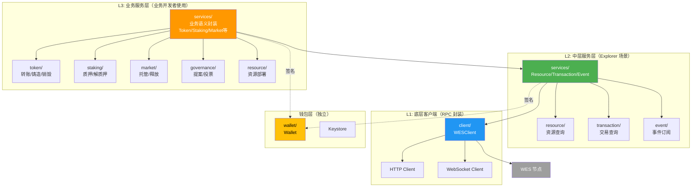
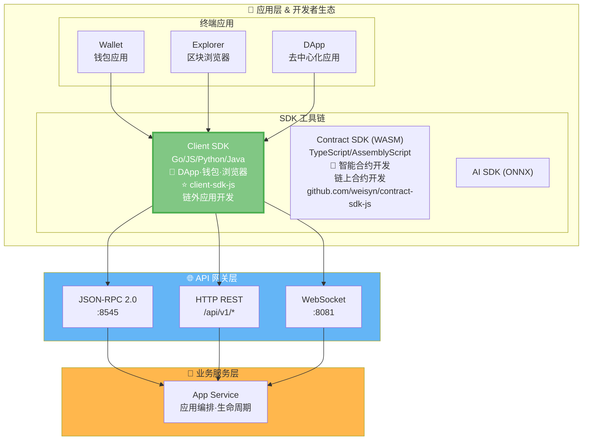
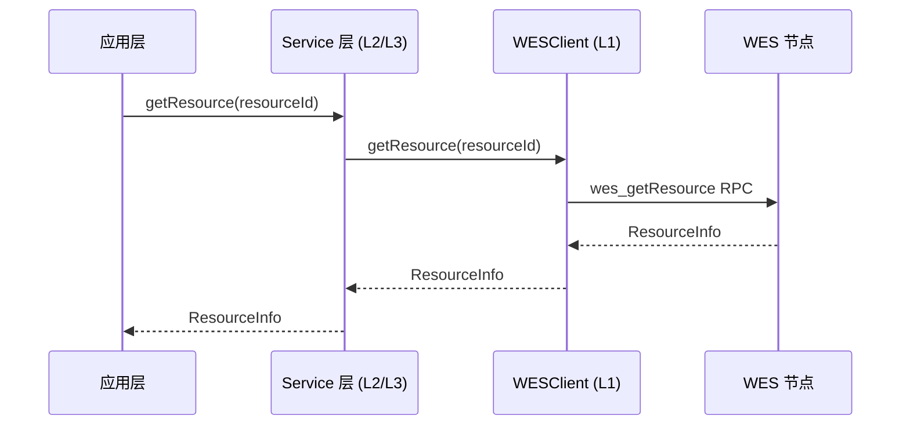
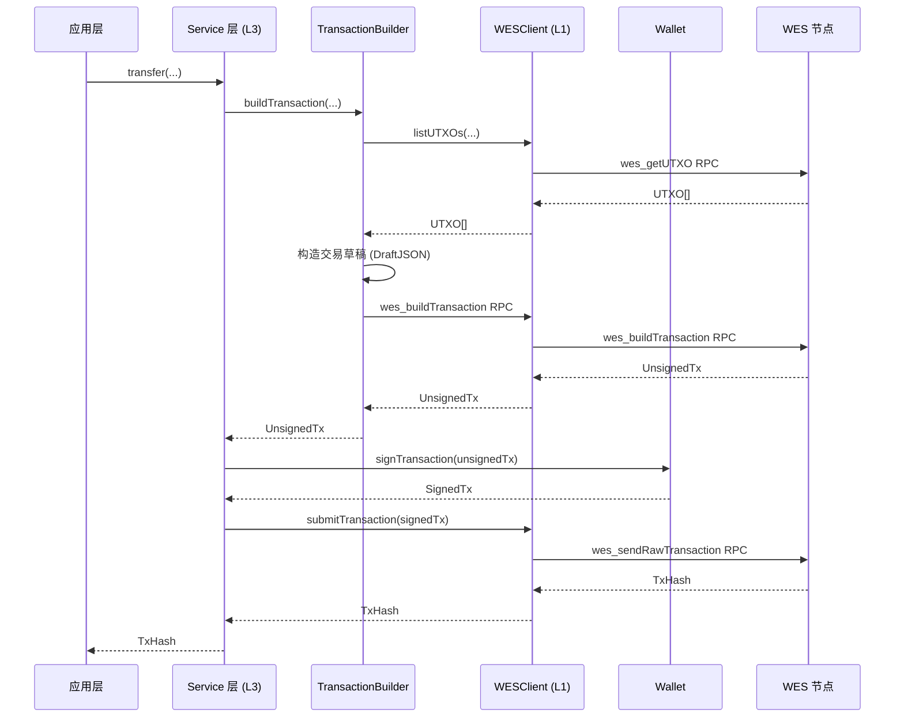
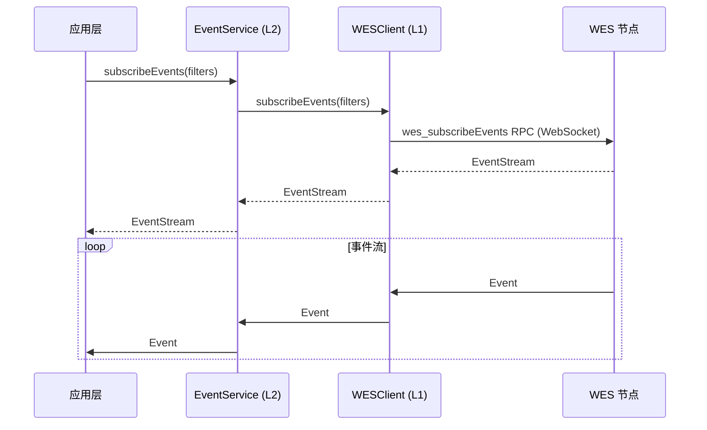
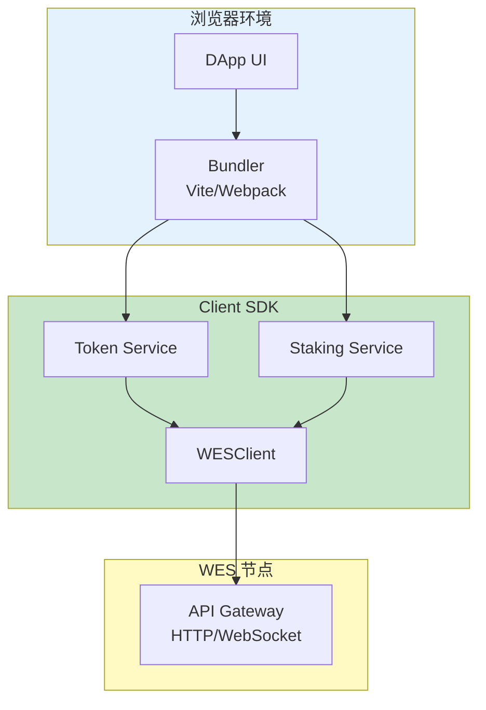
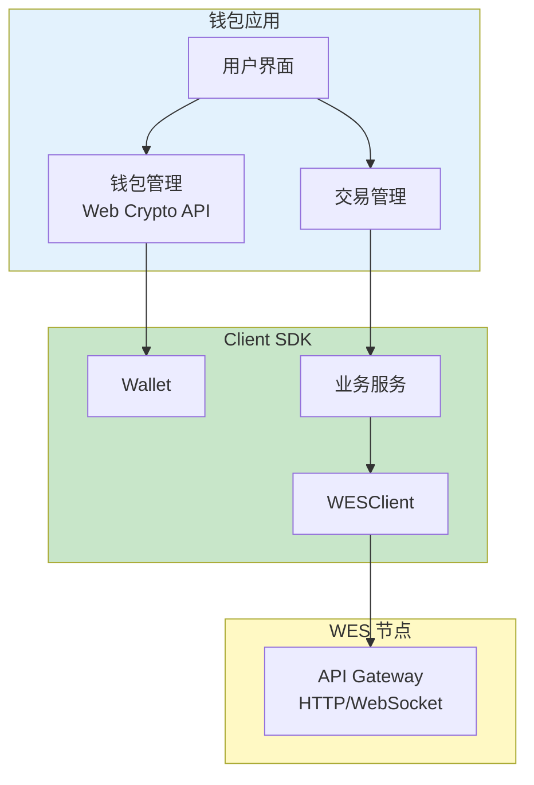
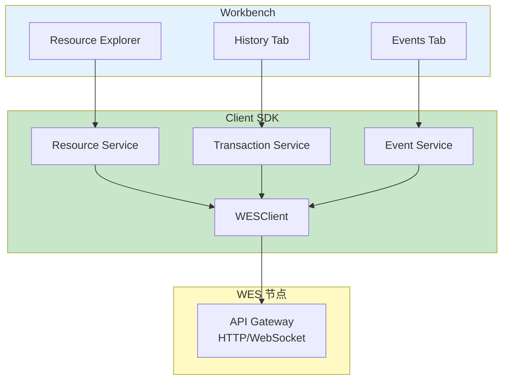

# Client SDK JS/TS - 场景可视化指南

**版本**: v1.0.0  

---

## 📋 文档定位

> 📌 **重要说明**：本文档提供 **SDK 相关的简明架构/场景图**。  
> 如需了解详细业务流图，请参考主仓库文档。

**本文档目标**：
- 提供 SDK 内部分层架构图
- 提供 SDK 与平台其他组件的交互图
- 可视化场景流程

---

## 🏗️ 架构图

### SDK 内部分层架构

### SDK 在 WES 7 层架构中的位置

---

## 📊 数据流图

### 查询流程

### 交易流程

### 事件订阅流程

---

## 🎯 场景图

### DApp 前端开发场景

### 钱包应用场景

### Workbench Explorer 场景

---

## 🔗 相关文档

- [SDK 架构](./SDK_ARCHITECTURE.md) - 架构设计
- [应用场景分析](./APPLICATION_SCENARIOS_ANALYSIS.md) - 场景分析
- [WES 系统架构文档](../../../weisyn.git/docs/system/architecture/1-STRUCTURE_VIEW.md) - 平台架构（主仓库）

---

  
**维护者**: WES Core Team
